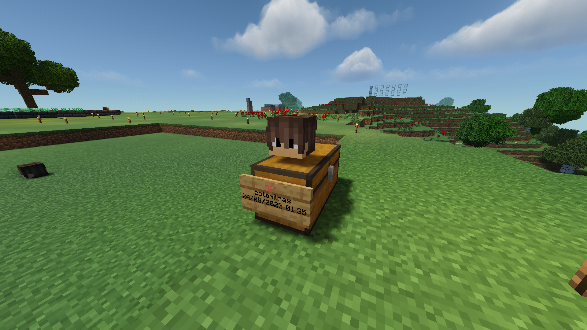
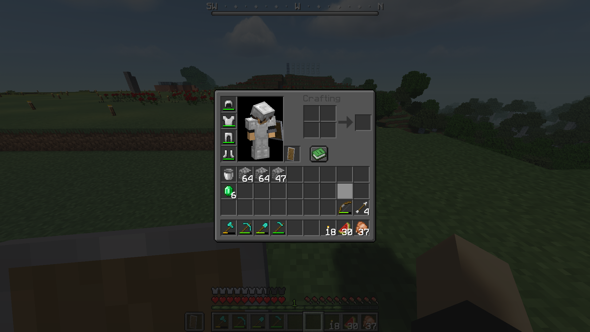
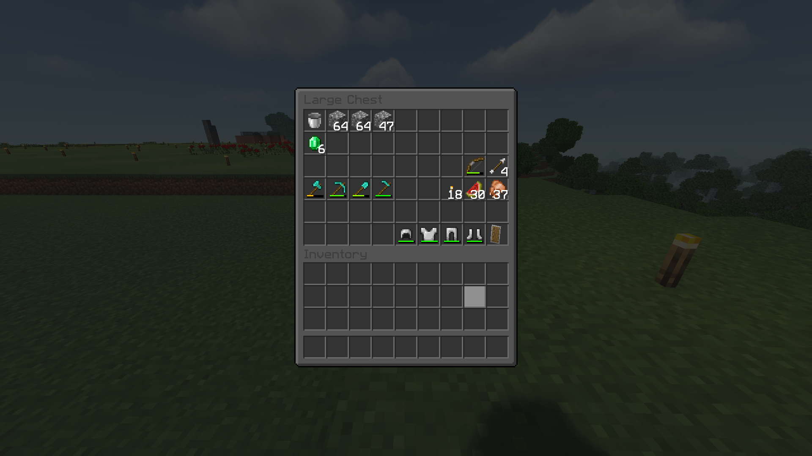
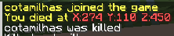

# GravePlugin

GravePlugin is a simple **Minecraft Paper Plugin** that creates a
custom **grave system** when a player dies. Instead of dropping items on
the ground, the plugin spawns a **double chest**, a **sign**, and a
**player head** to act as the player's grave.

## Features

-   Stores player items inside a **double chest** when they die.
-   Saves both **inventory items** and **armor/offhand items**.
-   Places a **sign** with the player's name, "RIP", and the death
    date/time.
-   Places a **player head** on top of the grave facing the correct
    direction.
-   Prevents graves (chests, signs, and heads) from dropping items when
    broken.
-   Sends a **death location message** to the player (with X, Y, Z
    coordinates).

## Showcase

### Grave



### Player Inventory Before Death



### Chest After Death



### Death Location Message



## How It Works

1.  When a player dies in **Survival** or **Adventure Mode**:
    -   The plugin clears the death drops.
    -   A **double chest** is created at the death location.
    -   The player's items are safely stored in the chest.
    -   A **sign** is placed next to the grave with:
        -   `RIP`
        -   Player's name
        -   Death date and time
    -   A **player head** with the dead player's skin is placed above
        the grave.
2.  If someone breaks the chest manually, its contents are dropped
    normally.
3.  The plugin prevents farming signs, heads, and chests from graves.

## Installation

1.  Download the plugin [here](https://github.com/cotamilhas/GravePlugin/releases/).
2.  Place it into your server's `plugins/` folder.
3.  Restart or reload your server.

## Compatibility

-   **Minecraft Version:** Tested on Paper 1.21+ (should work on Spigot
    too).
-   **Dependencies:** [Minecraft Development](https://plugins.jetbrains.com/plugin/8327-minecraft-development)

## Commands & Permissions

Currently, there are **no commands** and **no permissions** -- the
plugin runs automatically.

## Future Improvements

-   Configurable grave design (custom block types).
-   Configurable messages and sign text.
-   Grave protection & auto-removal after a set time.
-   Optional coordinates broadcast to teammates.

## Developer Notes

-   Source code is written in **Java** and built with **Maven**.

-   To compile the plugin:

    ``` bash
    mvn clean package
    ```

-   The compiled `.jar` will be inside the `target/` folder.

-   Contributions and pull requests are welcome!
